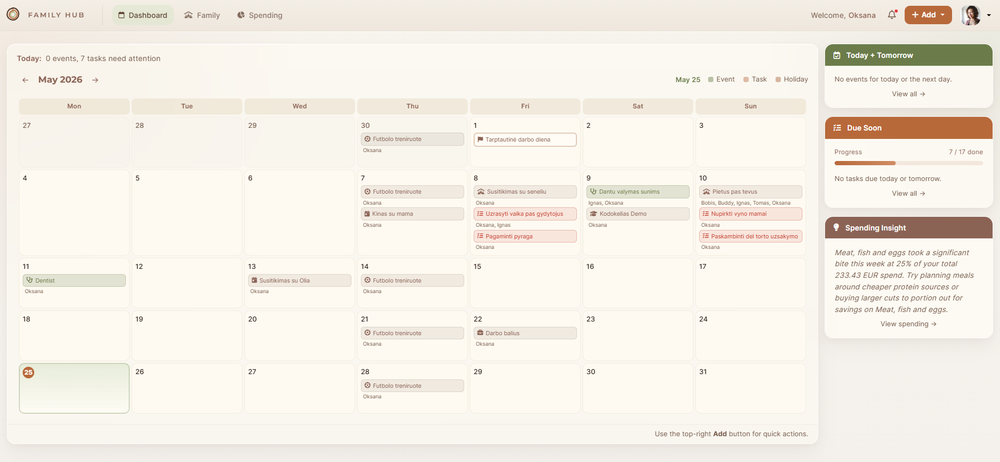
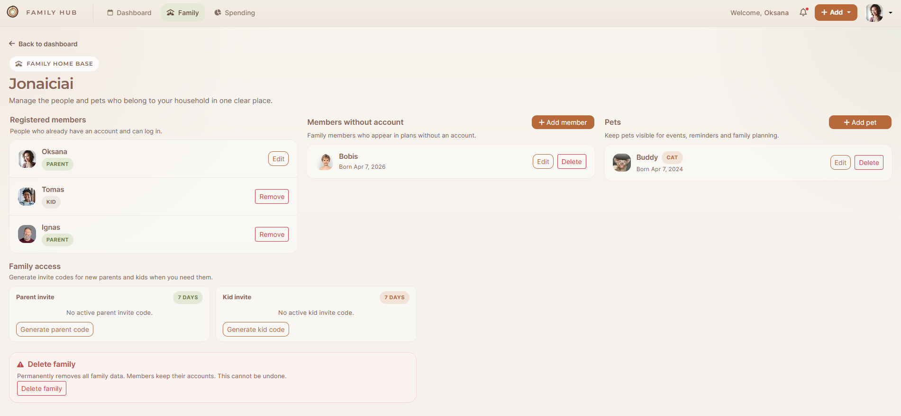
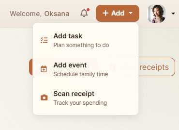
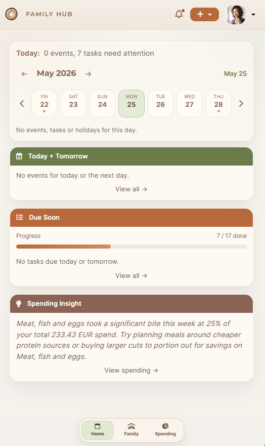
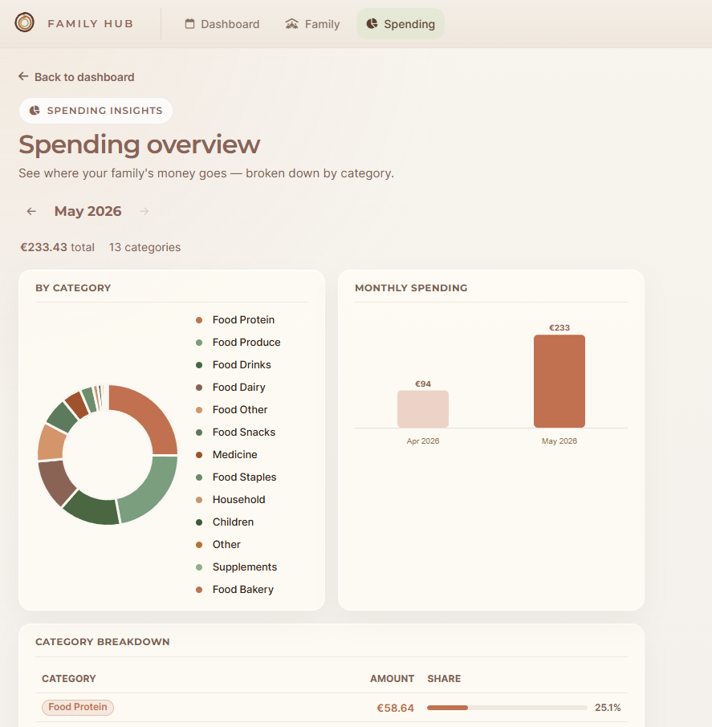

# Family Hub

**Family Hub** is a Spring Boot web application and family organizer designed to help families manage everyday tasks in one shared place. The system allows users to create a family, invite members to it, plan events in a shared calendar, manage tasks and notifications, and track family spending from scanned shopping receipts.

I also paid close attention to the user experience: clean navigation, minimal buttons, and simplicity were the main design goals.

The project was built as a practical Java / Spring Boot application using a layered architecture: controllers, services, repositories, DTOs, mappers, and JPA entities.

## Main Features

- User registration, login, remember-me authentication, and password reset.
- Family creation and joining through invite codes.
- Role-based access with `PARENT`, `KID`, and `ADMIN` roles.
- Management of family members without separate user accounts.
- Shared calendar with events, recurrence, participants, and public holidays.
- Task management with priorities, statuses, due dates, and assignments.
- In-app notifications and email reminders.
- Receipt upload and scanning with Gemini API.
- Spending statistics by category and month.
- Admin dashboard with platform statistics.

## Technologies Used

| Area | Technologies |
| --- | --- |
| Backend | Java 17, Spring Boot 3.4.5, Spring MVC |
| Security | Spring Security, BCrypt, session-based auth, Remember Me |
| Database | PostgreSQL, Spring Data JPA, Hibernate |
| Migrations | Flyway |
| Frontend | Thymeleaf, Bootstrap 5, CSS |
| Validation | Spring Validation |
| Object mapping | MapStruct |
| File storage | AWS S3 |
| AI / OCR | Gemini API |
| Email | Spring Mail / Brevo SMTP |
| Cache | Caffeine |
| Rate limiting | Bucket4j |
| Tests | JUnit 5, Spring Boot Test, Spring Security Test |
| Build | Maven |

## How to Use

1. Register a new user account.
2. Log in with your email and password.
3. Create a new family or join an existing family using an invite code.
4. Invite other users to the family and choose the appropriate role for them.
5. Add family members or pets who do not need their own user accounts.
6. Use the calendar to create family events, set dates, choose participants, and mark private events when needed.
7. Create tasks, set priorities and due dates, and assign them to users or family members.
8. Check notifications for task assignments, reminders, and other important updates.
9. Upload shopping receipt photos so the system can scan and categorize spending.
10. Review spending statistics to see monthly totals and category breakdowns.
11. Use the admin dashboard to view platform-level statistics when logged in as an admin user.

## Screenshots

### Dashboard



### Family



### Quick Add



### Mobile View



### Spending Statistics



## Project Structure

```text
src/main/java/com/familyhub
+-- config        # Spring, security, cache, S3, and MVC configuration
+-- controller    # HTTP controllers and page routes
+-- dto           # Request and response objects
+-- entity        # JPA entities and enum types
+-- exception     # Custom exceptions and global error handling
+-- mapper        # MapStruct mappers
+-- repository    # Spring Data JPA repositories
+-- security      # CustomUserDetails and authentication logic
+-- service       # Business logic
`-- util          # Helper classes

src/main/resources
+-- db/migration  # Flyway SQL migrations
+-- static        # CSS, images, and icons
`-- templates     # Thymeleaf HTML templates
```

## Security

- Passwords are stored using BCrypt hashing.
- Login is handled with server-side sessions.
- Remember Me authentication uses a configurable secret key.
- User permissions are limited by roles.
- Family data is isolated by `family_id`.
- Files stored in S3 are private and accessed through temporary pre-signed URLs.

## Project Status

The main parts of the application are implemented: authentication, family management, calendar, tasks, notifications, receipt scanning, spending statistics, and the admin dashboard.

Future improvements could include budget limits, a smart shopping list, and automatic reminders based on shopping habits.
