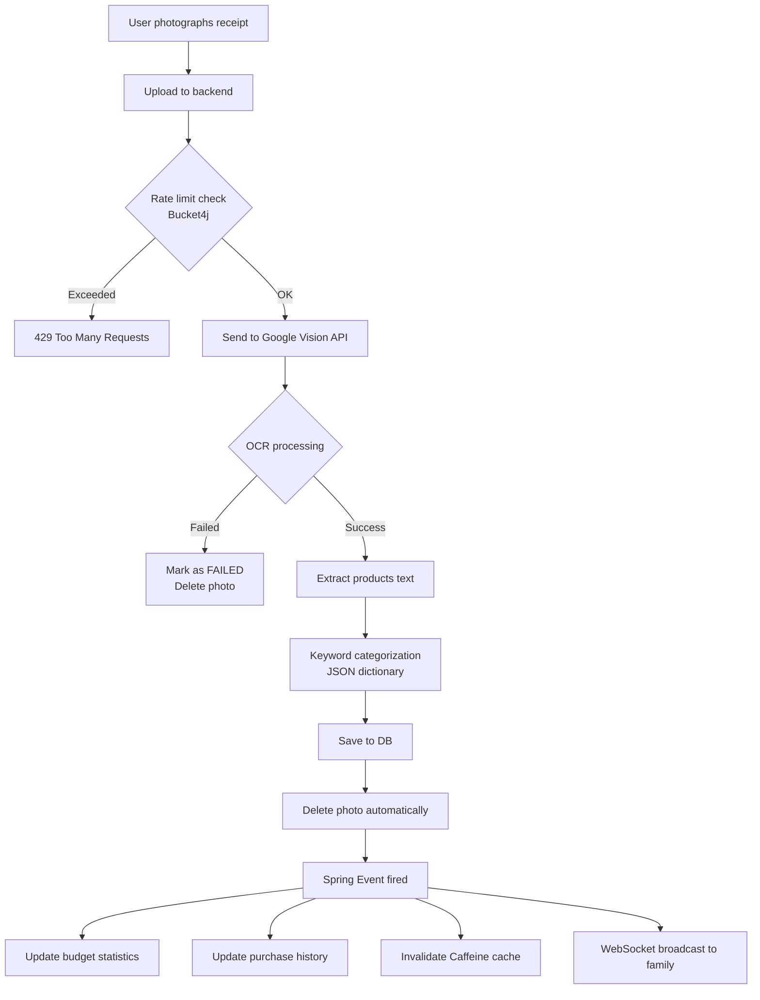
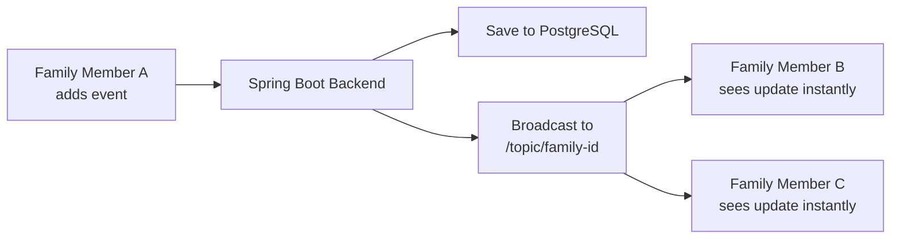
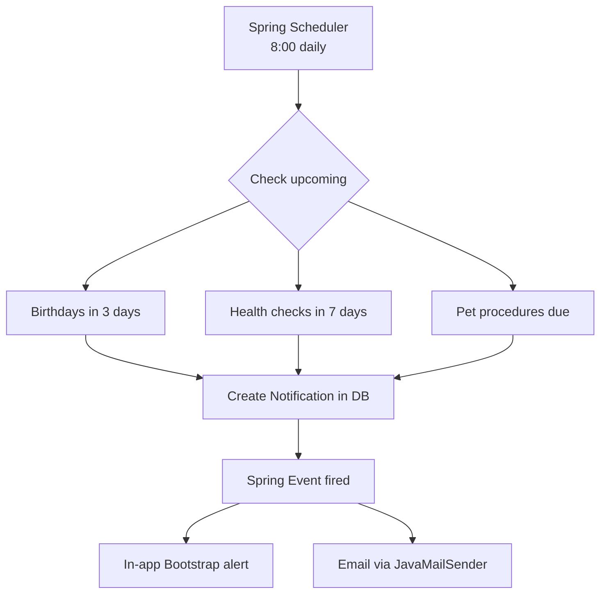
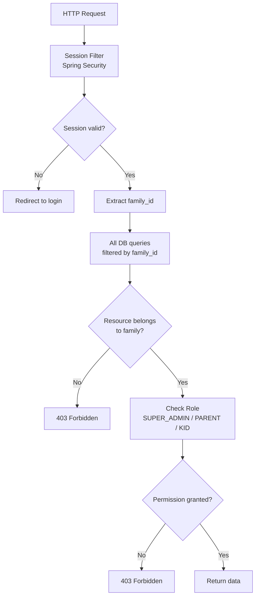
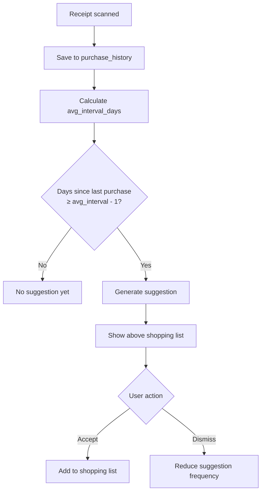

# Family Hub

> A full-featured family planning web application that brings together calendars, tasks, health tracking, budget management, and smart shopping — all in one place.

---

## About the Project

Modern families juggle dozens of separate apps — one for calendars, another for shopping, a third for budgeting. **Family Hub** solves this by unifying everything into a single shared space. The application lets families plan their lives together, track health reminders for both people and pets, manage budgets, and learn from everyday shopping habits. The system doesn't just store data — it works actively, reminding what's coming up, suggesting what to buy, and alerting when budgets are exceeded. Different family members have different access levels — parents manage, children participate based on their age.

---

## Table of Contents

- [Overview](#overview)
- [Tech Stack](#tech-stack)
- [Architecture](#architecture)
- [Database Schema](#database-schema)
- [Project Structure](#project-structure)

---

## Overview

Family Hub is a household management platform where family members can:

- Share a **calendar** with real-time synchronization, weather forecasts, and public holidays
- Manage a **task list** with drag & drop into the calendar
- Track **health reminders** for both people and pets
- **Scan receipts** with Google Vision API and automatically categorize spending
- Monitor a **family budget** with monthly limits and AI-powered insights
- Manage a **smart shopping list** that learns from purchase history
- Invite other members via a **shared invite code**
- Control what each family member can see and do based on their **role**

One user belongs to exactly one family. All data is fully isolated per family (multi-tenant architecture).

---

## Tech Stack

| Layer           | Technology                                    |
| --------------- | --------------------------------------------- |
| Backend         | Spring Boot 3, Spring MVC                     |
| Security        | Spring Security (session-based + Remember Me) |
| Persistence     | Spring Data JPA, Hibernate                    |
| Database        | PostgreSQL                                    |
| Real-time       | WebSockets + STOMP                            |
| Events          | Spring Events                                 |
| Scheduling      | Spring Scheduler                              |
| Cache           | Caffeine (in-memory)                          |
| Rate Limiting   | Bucket4j                                      |
| OCR             | Google Vision API                             |
| Categorization  | Keyword-based engine (JSON dictionary)        |
| Media Storage   | Cloudinary                                    |
| Weather         | OpenWeatherMap API                            |
| Public Holidays | Nager.Date API                                |
| Frontend        | Thymeleaf + Bootstrap 5                       |
| Drag & Drop     | SortableJS                                    |
| Build           | Maven                                         |

---

## Architecture

### System Overview

```
┌─────────────────────────────────────────────────────────┐
│              Thymeleaf + Bootstrap Frontend              │
│         Server-side rendering · SortableJS · Bootstrap  │
└──────────────────────┬──────────────────────────────────┘
                       │ HTTP + WebSockets
┌──────────────────────▼──────────────────────────────────┐
│                   Spring Boot Backend                    │
│                                                          │
│  ┌──────────┐ ┌──────────┐ ┌──────────┐ ┌───────────┐  │
│  │Controller│ │ Service  │ │Repository│ │  Security │  │
│  └──────────┘ └──────────┘ └──────────┘ └───────────┘  │
│                                                          │
│  ┌──────────┐ ┌──────────┐ ┌──────────┐ ┌───────────┐  │
│  │WebSocket │ │Scheduler │ │  Events  │ │ RateLimit │  │
│  └──────────┘ └──────────┘ └──────────┘ └───────────┘  │
└────┬──────────────┬──────────────┬──────────────┬───────┘
     │              │              │              │
┌────▼───┐    ┌─────▼────┐  ┌─────▼──────┐  ┌───▼──────────────┐
│  PgSQL │    │ Caffeine │  │ Cloudinary │  │ Google Vision API│
└────────┘    └──────────┘  └────────────┘  └──────────────────┘
```

### Receipt Scanning Flow



### Real-Time Synchronization



### Notification Chain



### Multi-Tenant Security



### Shopping Learning Algorithm



---

## Database Schema

**22 tables across 8 domains:**

| Domain              | Tables                                                                                                |
| ------------------- | ----------------------------------------------------------------------------------------------------- |
| Users & Family      | `users` `families` `kid_permissions` `password_reset_tokens`                                          |
| Calendar            | `events` `event_participants`                                                                         |
| Tasks               | `tasks` `task_assignees`                                                                              |
| Pets                | `pets` `pet_health_records`                                                                           |
| Health              | `user_health_records`                                                                                 |
| Receipts & Shopping | `receipts` `receipt_items` `shopping_list` `shopping_items` `purchase_history` `shopping_suggestions` |
| Budget              | `budget_limits` `family_insights`                                                                     |
| System              | `notifications` `audit_log`                                                                           |


---

## Project Structure

```
src/main/java/com/familyhub/
├── config/           # SecurityConfig, CaffeineConfig, CloudinaryConfig
├── controller/       # AuthController, FamilyController, TaskController,
│                     # EventController, PetController, HealthController,
│                     # ReceiptController, ShoppingController, BudgetController,
│                     # NotificationController, AdminController
├── service/          # Business logic per feature
├── repository/       # Spring Data JPA repositories
├── model/            # JPA entities: User, Family, Event, Task, Pet,
│                     # Receipt, ShoppingList, BudgetLimit, Notification...
│   └── enums/        # Role, TaskStatus, TaskPriority, EventType,
│                     # PetType, HealthType, Category...
├── dto/
│   ├── request/      # RegisterRequest, CreateTaskRequest, CreateEventRequest...
│   └── response/     # TaskResponse, EventResponse, FamilyResponse...
├── mapper/           # Entity ↔ DTO conversion
├── security/         # CustomUserDetails, CustomUserDetailsService
├── websocket/        # WebSocketConfig, WebSocketController
├── scheduler/        # BirthdayScheduler, HealthScheduler, CleanupScheduler
├── event/            # Spring Events & listeners
└── exception/        # Custom exceptions + GlobalExceptionHandler

src/main/resources/
├── templates/
│   ├── auth/         # login.html, register.html
│   ├── family/       # setup.html, index.html
│   ├── calendar/     # index.html, form.html
│   ├── tasks/        # index.html, form.html
│   ├── pets/         # index.html, form.html
│   ├── health/       # index.html, form.html
│   ├── shopping/     # index.html
│   ├── budget/       # index.html
│   ├── admin/        # index.html
│   ├── error/        # generic.html
│   └── dashboard.html
└── static/
    ├── css/          # Custom styles
    └── js/           # SortableJS + WebSocket client
```

---
