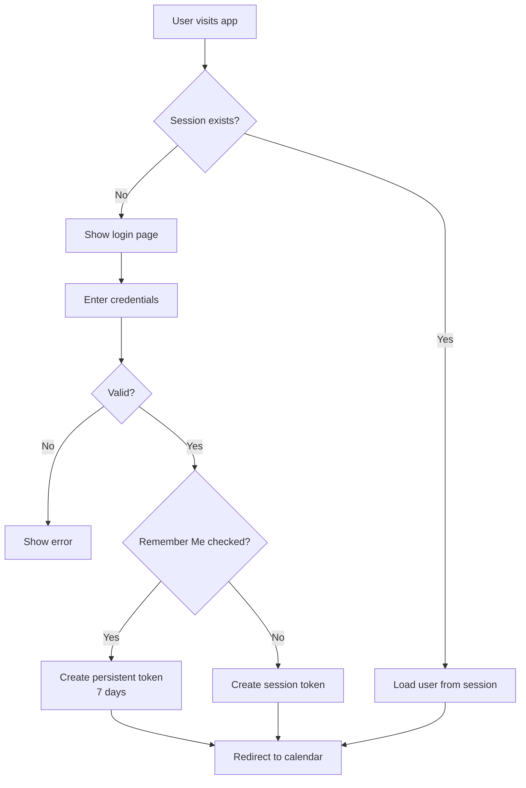
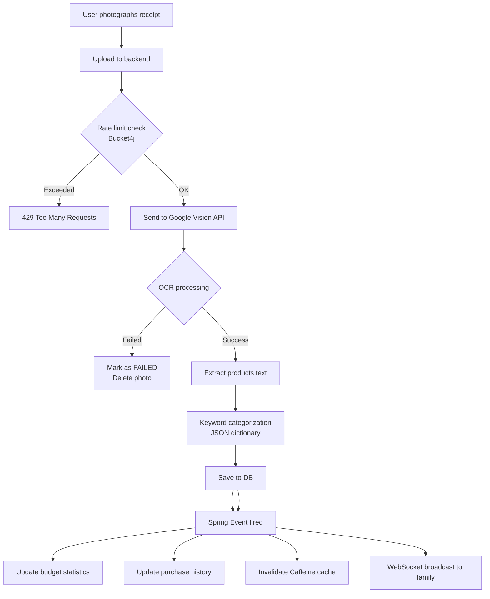
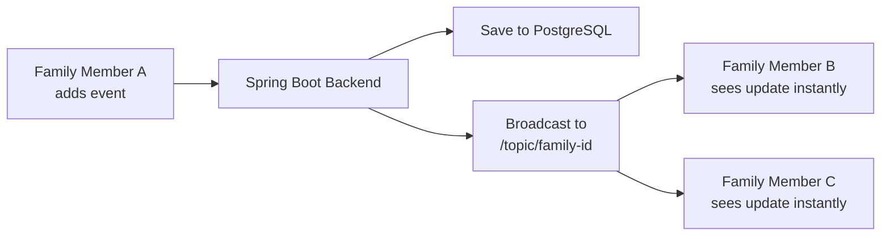
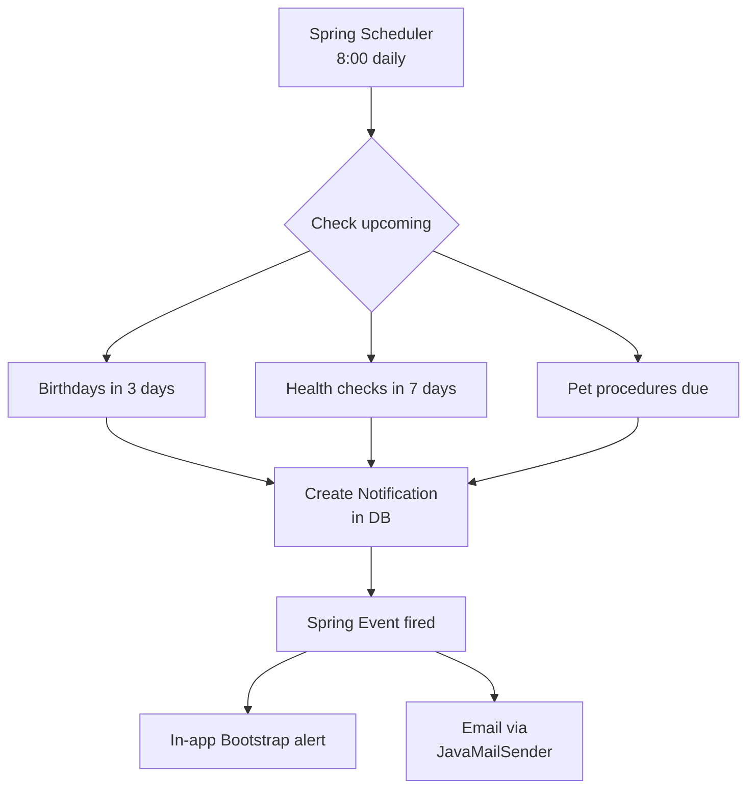
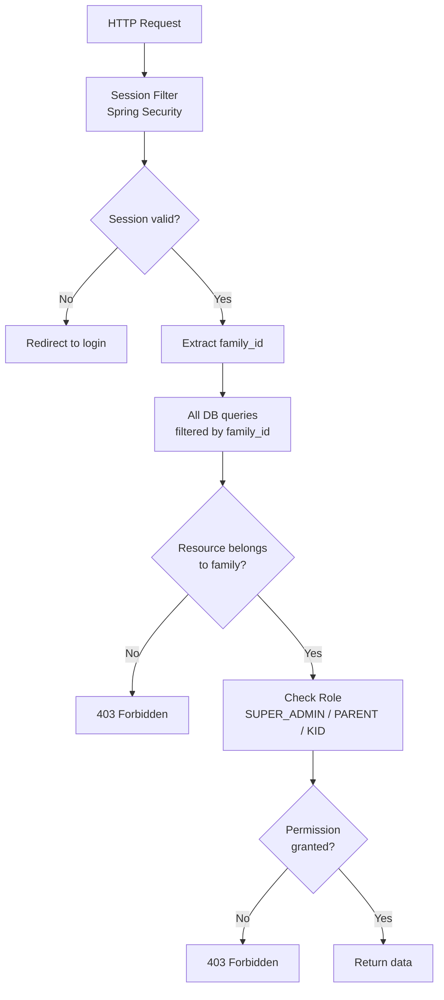
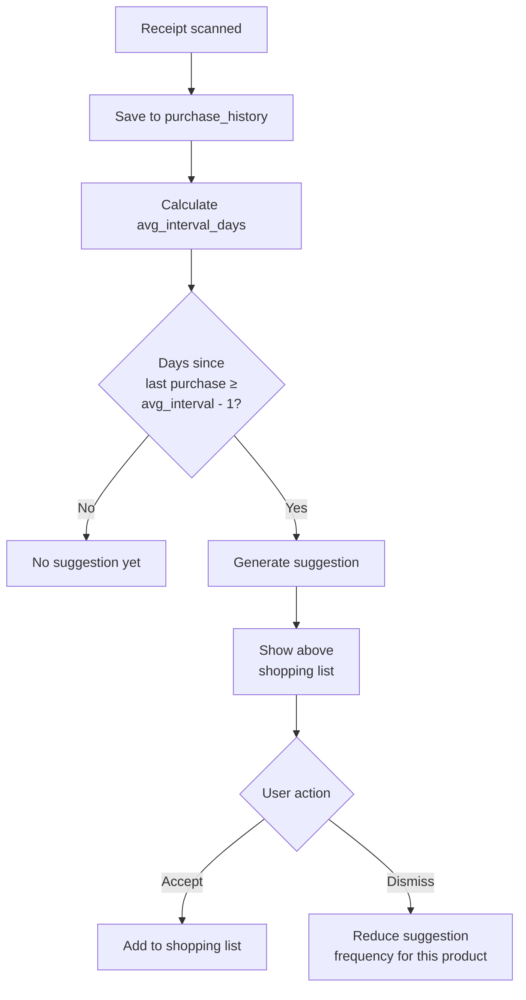

# 🏠 Family Hub

> A full-featured family planning web application that brings together calendars, tasks, health tracking, budget management, and smart shopping — all in one place.

---

## 📖 About the Project

Modern families juggle dozens of separate apps — one for calendars, another for shopping, a third for budgeting. **Family Hub** solves this by unifying everything into a single shared space. The application lets families plan their lives together, track health reminders for both people and pets, manage budgets, and learn from everyday shopping habits. The system doesn't just store data — it works actively, reminding what's coming up, suggesting what to buy, and alerting when budgets are exceeded. Different family members have different access levels — parents manage, children participate based on their age.

---

## ✨ Features

### 📅 Calendar
- Real-time synchronization via WebSockets — changes appear instantly for all family members
- Weather forecast per day (OpenWeatherMap API, Caffeine-cached hourly)
- Public holidays integration (Nager.Date API)
- Event types with icons: `DOCTOR` `DENTIST` `SCHOOL` `BIRTHDAY` `HIKE` `TRIP` `PARTY` `SHOPPING` `SPORT` `OTHER`
- Recurring events (e.g. weekly football practice)
- Private events — visible only to the creator (PARENT only)
- Automatic birthday events generated from `date_of_birth`
- Soft delete — events can be restored within 7 days
- Multiple participants per event — people and pets together

### ✅ Tasks
- Statuses: `TODO` → `SCHEDULED` → `DONE`
- Priorities: `LOW` `MEDIUM` `HIGH`
- Drag & Drop from task list into calendar (SortableJS)
- Assignable to multiple family members
- Private tasks (PARENT only)
- Soft delete with restore

### 🐾 Pets
- Pet types: `DOG` `CAT` `RABBIT` `BIRD` `FISH` `OTHER`
- Custom photo or icon (Cloudinary)
- Automatic birthday reminders
- Health tracking: vaccinations, flea/tick tablets, dental cleaning, bathing
- Configurable health cycles (e.g. every 3 months)
- Both parents see all pet health records

### 🏥 Human Health Reminders
- Reminder types: `DOCTOR` `DENTIST` `VISION` `VACCINE` `BLOOD_TEST` `OTHER`
- Configurable recurrence cycles
- Parents see their own and all children's reminders
- Kids see only their own

### 🧾 Receipt Scanning (AI)
- User photographs a receipt
- Google Vision API extracts shop name, date, products, quantities, prices
- Each item is automatically categorized using a keyword-based classification engine (JSON dictionary)
- Photo is deleted immediately after processing
- Rate limiting via Bucket4j — protects against excessive API calls
- Spring Events chain: `receipt scanned → categorization → statistics update → cache invalidation → WebSocket broadcast`

**Categories:**
| Food | Other |
|---|---|
| `FOOD_HEALTHY` — vegetables, fruit | `MEDICINE` — medicine, vitamins |
| `FOOD_SWEETS` — sweets, chocolate | `HYGIENE` — hygiene products |
| `FOOD_FASTFOOD` — fast food | `PETS` — pet food, supplies |
| `FOOD_ALCOHOL` — beer, wine, spirits | `ENTERTAINMENT` — books, toys |
| `FOOD_DRINKS` — juices, water, coffee | `CLOTHING` — clothes, footwear |
| | `HOUSEHOLD` — household items |

### 🛒 Smart Shopping List
- Manual product entry
- System learns from receipt history
- Automatically calculates average purchase interval
- Suggests products when it's time to restock
- Example: *"You buy milk every 7 days — today is day 6"*
- One-tap to add suggestions to the list
- System learns from dismissed suggestions

### 💰 Budget & Insights
- Monthly spending limits per category
- Alerts when approaching or exceeding limits (80% warning, 100% alert)
- Automatic insights:
  - *"Sweets spending is 40% higher than usual this month"*
  - *"Every Friday you buy pizza ingredients — today is Thursday!"*
  - *"Alcohol spending is higher than last month"*
  - *"Food costs down 15% this month — great job!"*
- Caffeine-cached budget statistics

### 🔔 Notifications
- In-app flash notifications (Bootstrap alerts)
- Email notifications (JavaMailSender + Spring Events)
- 7-day notification history
- Types: birthdays, health reminders, pet health, budget alerts, shopping suggestions, event reminders
- Configurable — users can toggle each notification type

### 👤 User Management
- Registration & login with Session-based authentication
- Remember Me — stay logged in for 7 days
- Password reset via email
- Custom avatar photo or pre-made icons (Cloudinary)
- Dark / light mode (Bootstrap themes)
- Mobile responsive design (Bootstrap)
- Soft delete

### 🔐 Security
- Spring Security with session-based authentication
- Remember Me with secure token
- Multi-tenant architecture — families are fully isolated at the data level
- Role-based access control
- Dynamic KID permissions managed by PARENT
- Rate limiting (Bucket4j) — brute force and API abuse protection
- Password reset tokens with expiry

### 🛠️ Admin Panel (SUPER_ADMIN)
- View all families and users
- Access audit log (7-day history)
- Delete family only upon PARENT request
- Block / unblock users

---

## 🏗️ Architecture

### System Overview

```
┌─────────────────────────────────────────────────────────┐
│              Thymeleaf + Bootstrap Frontend              │
│         Server-side rendering · SortableJS · Bootstrap  │
└──────────────────────┬──────────────────────────────────┘
                       │ HTTP + WebSockets
┌──────────────────────▼──────────────────────────────────┐
│                   Spring Boot Backend                    │
│                                                          │
│  ┌──────────┐ ┌──────────┐ ┌──────────┐ ┌───────────┐  │
│  │Controller│ │ Service  │ │Repository│ │  Security │  │
│  └──────────┘ └──────────┘ └──────────┘ └───────────┘  │
│                                                          │
│  ┌──────────┐ ┌──────────┐ ┌──────────┐ ┌───────────┐  │
│  │WebSocket │ │Scheduler │ │  Events  │ │ RateLimit │  │
│  └──────────┘ └──────────┘ └──────────┘ └───────────┘  │
└────┬──────────────┬──────────────┬───────────────┬──────┘
     │              │              │               │
┌────▼───┐    ┌─────▼────┐  ┌─────▼──────┐  ┌──────────────────┐
│  PgSQL │    │ Caffeine │  │ Cloudinary │  │ Google Vision API│
└────────┘    └──────────┘  └────────────┘  └──────────────────┘
```

### Authentication Flow



### Receipt Scanning Flow



### Real-Time Synchronization Flow



### Notification Chain



### Multi-Tenant Security



### Shopping Learning Algorithm



---

## 🗄️ Database Schema

**22 tables across 8 domains:**

| Domain | Tables |
|---|---|
| Users & Family | `users` `families` `kid_permissions` `password_reset_tokens` |
| Calendar | `events` `event_participants` |
| Tasks | `tasks` `task_assignees` |
| Pets | `pets` `pet_health_records` |
| Health | `user_health_records` |
| Receipts & Shopping | `receipts` `receipt_items` `shopping_list` `shopping_items` `purchase_history` `shopping_suggestions` |
| Budget | `budget_limits` `family_insights` |
| System | `notifications` `audit_log` |

---

## ⚙️ Tech Stack

| Layer | Technology |
|---|---|
| Backend | Spring Boot |
| Security | Spring Security (Session-based + Remember Me) |
| Real-time | WebSockets + STOMP |
| Events | Spring Events |
| Scheduling | Spring Scheduler |
| Cache | Caffeine (in-memory) |
| Rate Limiting | Bucket4j |
| OCR | Google Vision API |
| Categorization | Keyword-based engine (JSON dictionary) |
| Media Storage | Cloudinary |
| Weather | OpenWeatherMap API |
| Public Holidays | Nager.Date API |
| Frontend | Thymeleaf + Bootstrap 5 |
| Drag & Drop | SortableJS |
| Database | PostgreSQL |

---

## 🔄 Automated Processes

| Process | Schedule |
|---|---|
| Birthday checks (people & pets) | Daily at 08:00 |
| Human health reminders | Daily at 08:00 |
| Pet health reminders | Daily at 08:00 |
| Budget insights generation | Daily at midnight |
| Shopping suggestions update | Daily at midnight |
| Delete old notifications (7d+) | Daily at midnight |
| Delete old audit logs (7d+) | Daily at midnight |
| Delete expired reset tokens | Daily at midnight |

---

## 🗃️ Caffeine Cache Strategy

| Data | TTL |
|---|---|
| Weather forecast | 1 hour |
| Public holidays | 24 hours |
| Budget statistics | 6 hours |
| Family events | Evicted on create/update |

---

## 👥 Roles & Permissions

| Feature | SUPER_ADMIN | PARENT | KID |
|---|---|---|---|
| View all families | ✅ | ❌ | ❌ |
| Manage family members | ❌ | ✅ | ❌ |
| Create events | ✅ | ✅ | ⚙️ configurable |
| Create tasks | ✅ | ✅ | ⚙️ configurable |
| Scan receipts | ✅ | ✅ | ⚙️ configurable |
| View budget | ✅ | ✅ | ⚙️ configurable |
| Private events/tasks | ❌ | ✅ | ❌ |
| View audit log | ✅ | ❌ | ❌ |
| Delete family | ✅ | ❌ | ❌ |

> ⚙️ KID permissions are dynamically assigned by PARENT based on the child's age.

---

## 🗂️ Package Structure

```
com.familyhub
├── controller        # HTTP endpoints + Thymeleaf view controllers
├── service           # Business logic
├── repository        # Data access layer (JPA)
├── model             # JPA entities
├── dto
│   ├── request       # Incoming form/request data
│   └── response      # Outgoing data objects
├── security          # Spring Security config, Remember Me
├── websocket         # WebSocket config & controllers
├── scheduler         # Spring Scheduler tasks
├── event             # Spring Events & listeners
├── exception         # Global exception handling
└── config            # Caffeine cache, Cloudinary, API configs

src/main/resources
├── templates         # Thymeleaf HTML templates
│   ├── calendar
│   ├── tasks
│   ├── pets
│   ├── health
│   ├── shopping
│   ├── budget
│   └── admin
└── static
    ├── css           # Custom styles
    └── js            # SortableJS + WebSocket client
```

---

## 🚀 Getting Started

### Prerequisites
- Java 17
- Maven
- PostgreSQL

### Environment Variables

```properties
# Database
SPRING_DATASOURCE_URL=jdbc:postgresql://localhost:5432/familyhub
SPRING_DATASOURCE_USERNAME=your_username
SPRING_DATASOURCE_PASSWORD=your_password

# Remember Me
REMEMBER_ME_KEY=familyHubSecretKey
REMEMBER_ME_VALIDITY=604800

# Google Vision API
GOOGLE_VISION_API_KEY=your_api_key

# Cloudinary
CLOUDINARY_CLOUD_NAME=your_cloud_name
CLOUDINARY_API_KEY=your_api_key
CLOUDINARY_API_SECRET=your_api_secret

# OpenWeatherMap
WEATHER_API_KEY=your_api_key

# Mail
SPRING_MAIL_HOST=smtp.gmail.com
SPRING_MAIL_PORT=587
SPRING_MAIL_USERNAME=your_email
SPRING_MAIL_PASSWORD=your_password
```

### Run the project

```bash
# Clone the repository
git clone https://github.com/yourusername/family-hub.git
cd family-hub

# Run the application
mvn spring-boot:run

# Open in browser
http://localhost:8080
```

---

## 🗺️ Roadmap

### v1 (current)
- All core features
- English language only
- Thymeleaf server-side rendering

### v2 (planned)
- Lithuanian language support (i18n)
- Timezone support for travelling families

---

## 📄 License

This project is built as a portfolio project for learning purposes.
