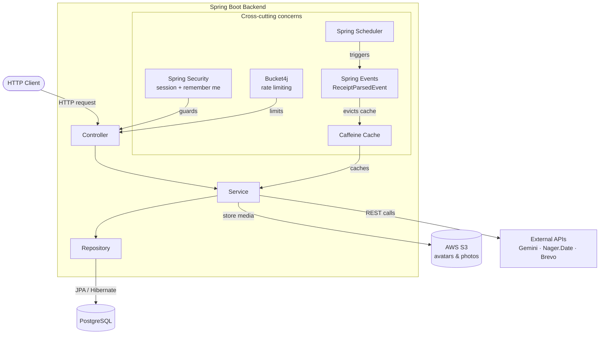
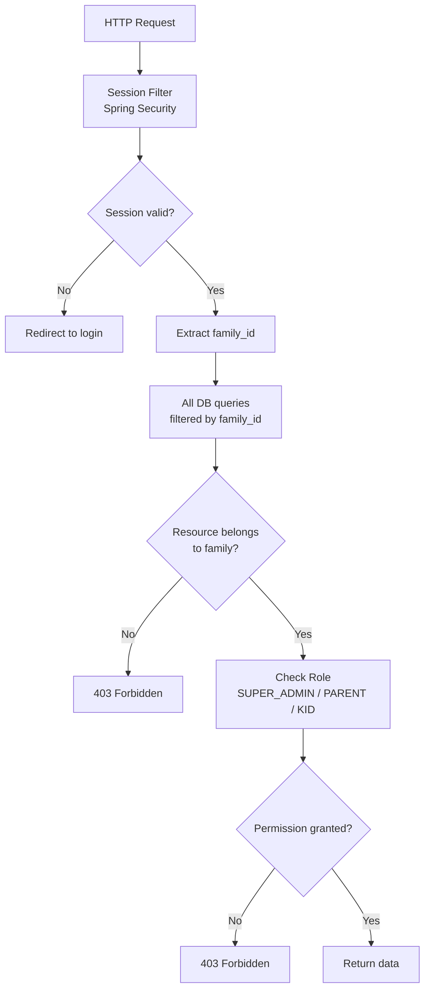
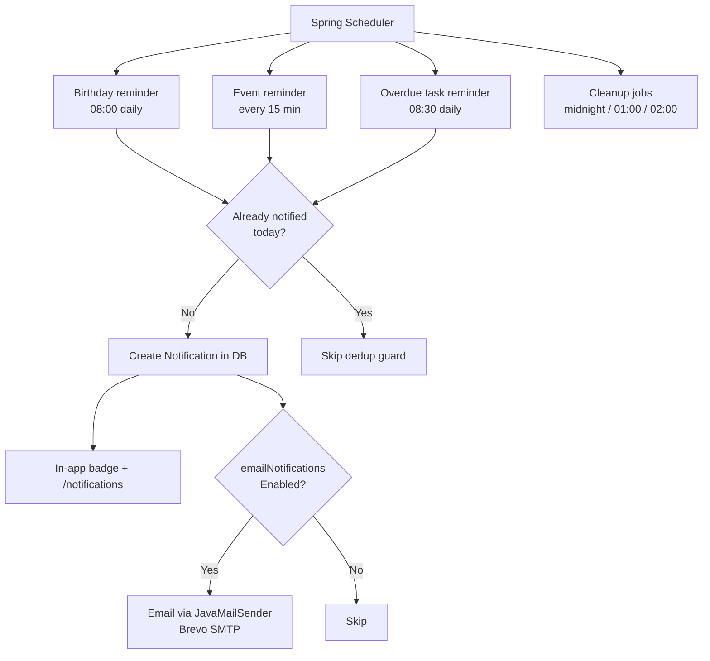
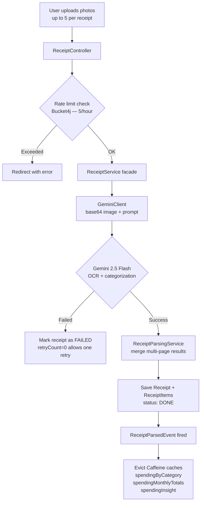
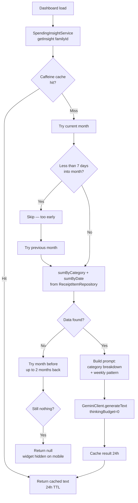

# Family Hub — Architecture Diagrams

---

## Table of Contents

- [System Overview](#system-overview)
- [Backend Architecture](#backend-architecture)
- [Multi-Tenant Security](#multi-tenant-security)
- [Cache Invalidation Flow](#cache-invalidation-flow)
- [Notification Chain](#notification-chain)
- [Receipt Scanning Flow](#receipt-scanning-flow)
- [Spending Insight Flow](#spending-insight-flow)

---

## System Overview

```
┌─────────────────────────────────────────────────────────┐
│              Thymeleaf + Bootstrap Frontend              │
│              Server-side rendering · Bootstrap 5         │
└──────────────────────┬──────────────────────────────────┘
                       │ HTTP
┌──────────────────────▼──────────────────────────────────┐
│                   Spring Boot Backend                    │
│                                                          │
│  ┌──────────┐ ┌──────────┐ ┌──────────┐                 │
│  │Controller│ │ Service  │ │Repository│                 │
│  └──────────┘ └──────────┘ └──────────┘                 │
│                                                          │
│  Cross-cutting concerns:                                 │
│  · Spring Security (session + remember me)               │
│  · Spring Scheduler                                      │
│  · Spring Events (ReceiptParsedEvent → cache eviction)   │
│  · Caffeine cache                                        │
│  · Bucket4j rate limiting                                │
└────┬──────────────┬──────────────┬──────────────┬───────┘
     │              │              │              │
┌────▼───────┐ ┌────▼───────┐ ┌───▼────────┐ ┌───▼──────────────────────┐
│ PostgreSQL │ │  AWS S3    │ │  Caffeine  │ │   External APIs          │
│ 15 tables  │ │ Avatars &  │ │ In-memory  │ │ · Gemini 2.5 Flash       │
│ multi-     │ │ photos     │ │ cache      │ │   (vision + text)        │
│ tenant     │ └────────────┘ └────────────┘ │ · Nager.Date API         │
└────────────┘                               │ · Brevo SMTP (email)     │
                                             └──────────────────────────┘
```

---

## Backend Architecture



---

## Multi-Tenant Security



---

## Cache Invalidation Flow

```mermaid
flowchart LR
    A[User uploads\nreceipt] --> B[ReceiptService]
    B --> C[Save to PostgreSQL\nstatus: DONE]
    B --> D[ReceiptParsedEvent fired]
    D --> E[SpendingService\n@EventListener]
    E --> F[Evict:\nspendingByCategory\nspendingMonthlyTotals\nspendingInsight]
    F --> G[Next page load\nfetches fresh data]
```

---

## Notification Chain



---

## Receipt Scanning Flow



---

## Spending Insight Flow


