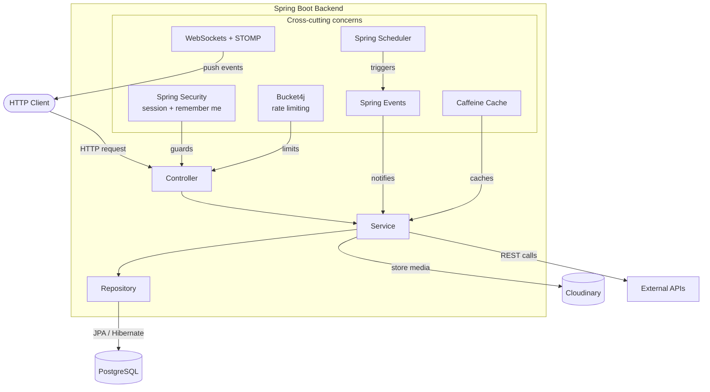
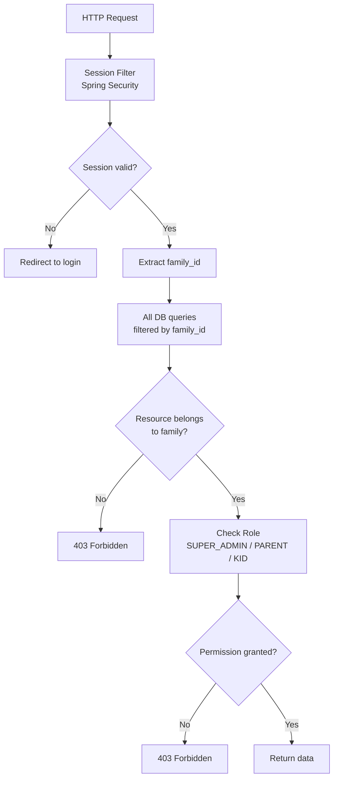
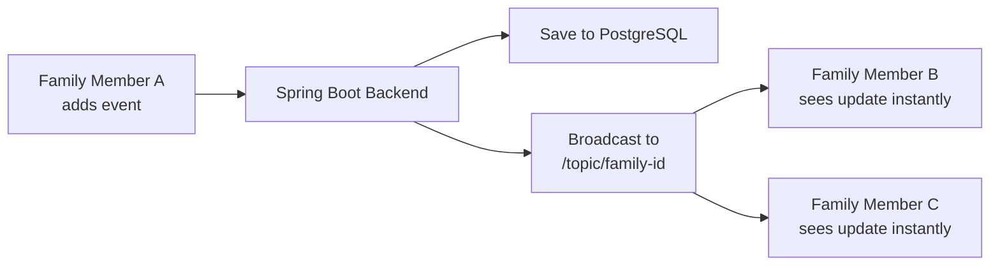
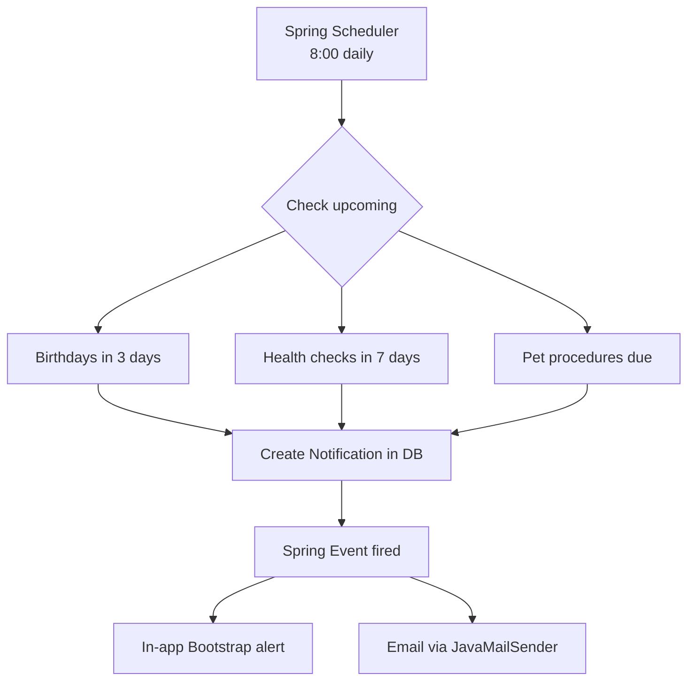
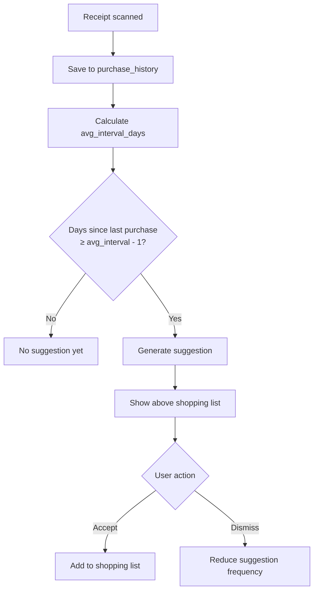

# Family Hub — Architecture Diagrams

---

## Table of Contents

- [System Overview](#system-overview)
- [Backend Architecture](#backend-architecture)
- [Multi-Tenant Security](#multi-tenant-security)
- [Real-Time Synchronization](#real-time-synchronization)
- [Notification Chain](#notification-chain)
- [Receipt Scanning Flow](#receipt-scanning-flow)
- [Shopping Learning Algorithm](#shopping-learning-algorithm)

---

## System Overview

```
┌─────────────────────────────────────────────────────────┐
│              Thymeleaf + Bootstrap Frontend              │
│         Server-side rendering · SortableJS · Bootstrap  │
└──────────────────────┬──────────────────────────────────┘
                       │ HTTP + WebSockets
┌──────────────────────▼──────────────────────────────────┐
│                   Spring Boot Backend                    │
│                                                          │
│  ┌──────────┐ ┌──────────┐ ┌──────────┐                 │
│  │Controller│ │ Service  │ │Repository│                 │
│  └──────────┘ └──────────┘ └──────────┘                 │
│                                                          │
│  Cross-cutting concerns:                                 │
│  · Spring Security (session + remember me)               │
│  · WebSockets + STOMP                                    │
│  · Spring Scheduler                                      │
│  · Spring Events                                         │
│  · Caffeine cache                                        │
│  · Bucket4j rate limiting                                │
└────┬──────────────┬──────────────┬──────────────┬───────┘
     │              │              │              │
┌────▼───────┐ ┌────▼───────┐ ┌───▼────────┐ ┌───▼──────────────────┐
│ PostgreSQL │ │ Cloudinary │ │  Caffeine  │ │   External APIs      │
│ 22 tables  │ │ Avatars &  │ │ In-memory  │ │ · Google Vision API  │
│ multi-     │ │ icons      │ │ cache      │ │ · OpenWeatherMap      │
│ tenant     │ └────────────┘ └────────────┘ │ · Nager.Date API     │
└────────────┘                               │ · SMTP (email)       │
                                             └──────────────────────┘
```

---

## Backend Architecture



---

## Multi-Tenant Security



---

## Real-Time Synchronization



---

## Notification Chain



---

## Receipt Scanning Flow

```mermaid
flowchart TD
    A[User photographs receipt] --> B[Upload to backend]
    B --> C{Rate limit check\nBucket4j}
    C -- Exceeded --> D[429 Too Many Requests]
    C -- OK --> E[Send to Google Vision API]
    E --> F{OCR processing}
    F -- Failed --> G[Mark as FAILED\nDelete photo]
    F -- Success --> H[Extract products text]
    H --> I[Keyword categorization\nJSON dictionary]
    I --> J[Save to DB]
    J --> K[Delete photo automatically]
    K --> L[Spring Event fired]
    L --> M[Update budget statistics]
    L --> N[Update purchase history]
    L --> O[Invalidate Caffeine cache]
    L --> P[WebSocket broadcast to family]
```



---

## Shopping Learning Algorithm


