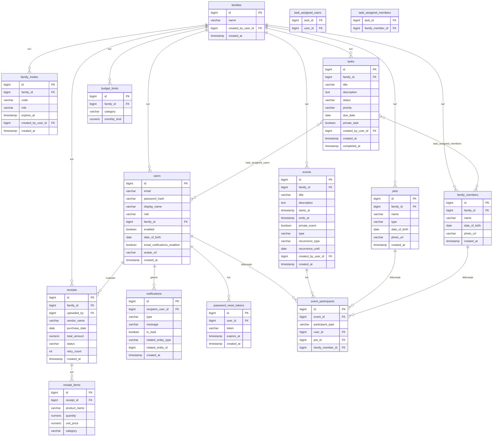

# Family Hub — Database Schema (ERD)

> For the interactive ERD diagram with zoom and pan, open `doc/family_hub_erd.html` in your browser.

---

## Entity Relationship Diagram



---

## Table Descriptions

```
families              — Family profile; created_by_user_id identifies the founding PARENT
users                 — All registered users; role = PARENT | KID | ADMIN
family_invites        — Invite codes (12 chars, 7-day expiry, reusable); role = PARENT | KID
family_members        — People without accounts (toddlers, elderly); managed by PARENT
password_reset_tokens — Single-use expiring tokens for the password reset flow
events                — Family calendar events with optional recurrence and privacy flag
event_participants    — Polymorphic join: user_id, pet_id, or family_member_id (one set per row)
tasks                 — Family task list; private_task hides from KID role
task_assigned_users   — Many-to-many: tasks ↔ registered users
task_assigned_members — Many-to-many: tasks ↔ family members (no account)
pets                  — Family pets; can participate in events
receipts              — Scanned receipts; status = PROCESSING | DONE | FAILED; retry_count ≤ 1
receipt_items         — Line items extracted by Gemini; category = SpendingCategory enum (21 values)
budget_limits         — Monthly spending cap per category per family; UNIQUE(family_id, category)
notifications         — In-app alerts; related_entity_type/id links to the source record
```

---

## Flyway Migration History

| Version | Description                                      |
| ------- | ------------------------------------------------ |
| V1      | Initial schema — core tables                     |
| V2      | Align with JPA model — adds columns, family_members, task assignment tables, password_reset_tokens |
| V3      | Drop unused `family_invites.used` column         |
| V4      | Receipt scanning — `receipts`, `receipt_items`, `budget_limits` |
| V5      | Migrate old spending category values to new enum |
| V6      | Add `retry_count` column to `receipts`           |
