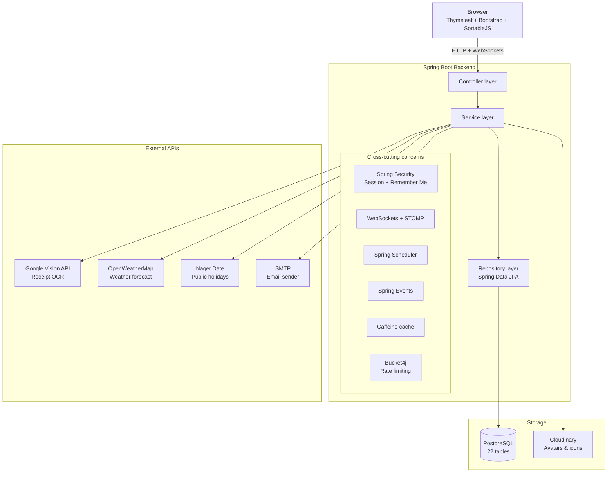
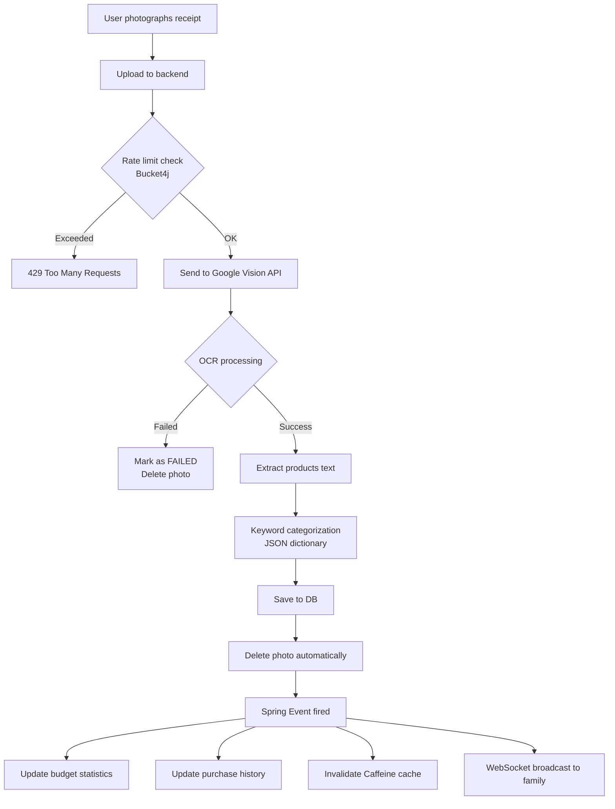
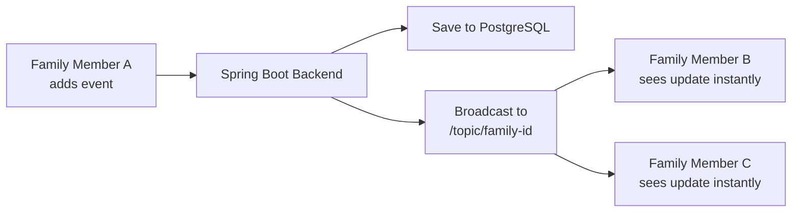
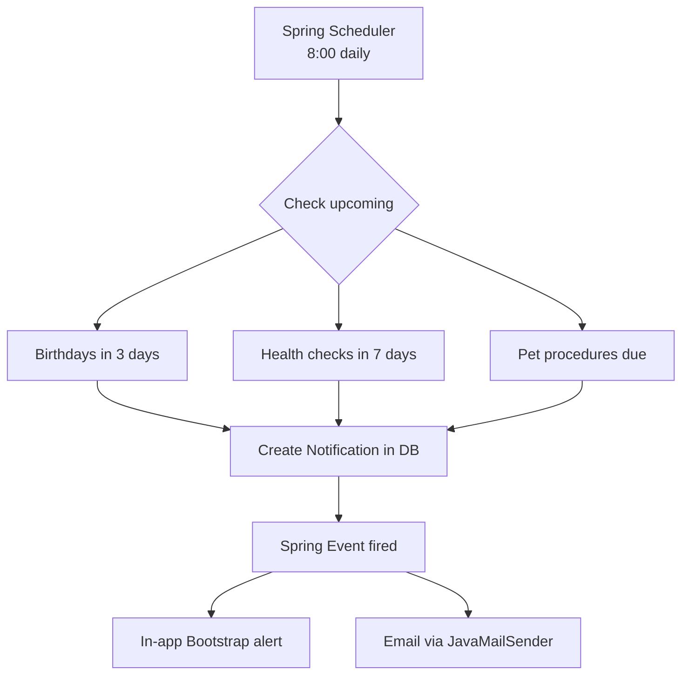
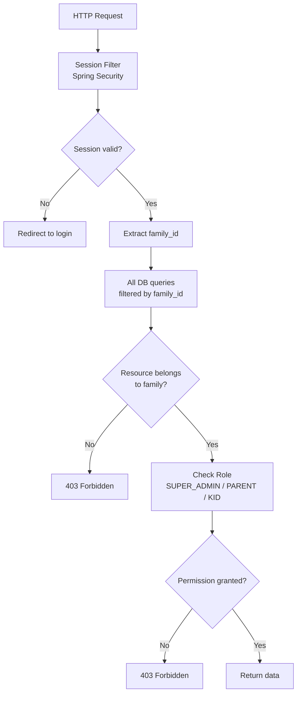
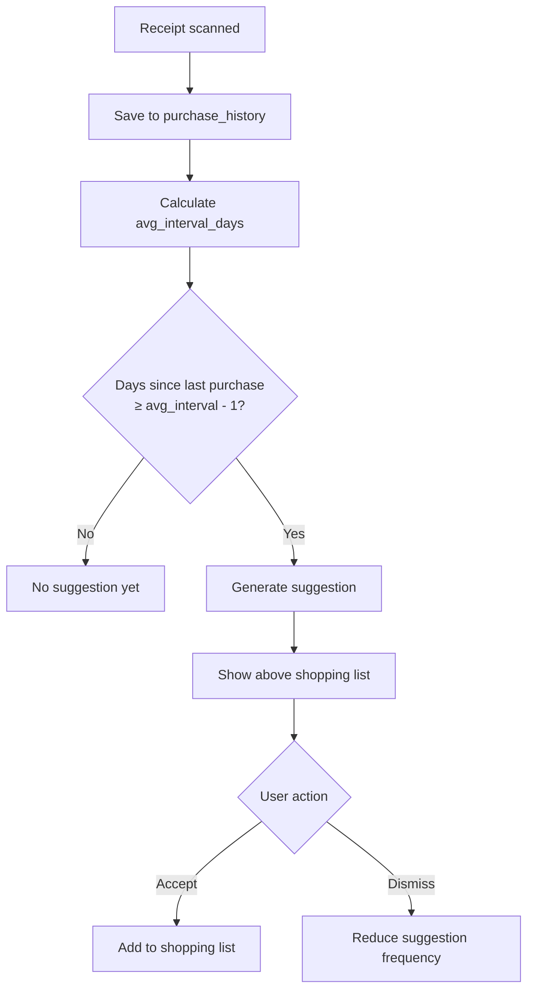

# Family Hub — Database Schema & Architecture Diagrams

---

## Table of Contents

- [Database Schema (ERD)](#database-schema-erd)
- [System Overview](#system-overview)
- [Receipt Scanning Flow](#receipt-scanning-flow)
- [Real-Time Synchronization](#real-time-synchronization)
- [Notification Chain](#notification-chain)
- [Multi-Tenant Security](#multi-tenant-security)
- [Shopping Learning Algorithm](#shopping-learning-algorithm)
- [Table Descriptions](#table-descriptions)

---

## Database Schema (ERD)

> For the interactive ERD diagram with zoom and pan, open `doc/family_hub_erd.html` in your browser.

```mermaid
erDiagram
  families ||--o{ users : "turi"
  families ||--o{ events : "turi"
  families ||--o{ tasks : "turi"
  families ||--o{ pets : "turi"
  families ||--o{ receipts : "turi"
  families ||--o{ budget_limits : "turi"
  families ||--o{ shopping_list : "turi"
  families ||--o{ purchase_history : "turi"
  families ||--o{ family_insights : "turi"
  families ||--o{ notifications : "turi"
  users ||--o{ kid_permissions : "turi"
  users ||--o{ event_participants : "dalyvauja"
  users ||--o{ task_assignees : "atsakingas"
  users ||--o{ user_health_records : "turi"
  users ||--o{ notifications : "gauna"
  users ||--o{ audit_log : "kuria"
  users ||--o{ password_reset_tokens : "turi"
  users ||--o{ receipts : "nuskaito"
  events ||--o{ event_participants : "turi"
  tasks ||--o{ task_assignees : "turi"
  pets ||--o{ event_participants : "dalyvauja"
  pets ||--o{ pet_health_records : "turi"
  receipts ||--o{ receipt_items : "turi"
  shopping_list ||--o{ shopping_items : "turi"
  purchase_history ||--o{ shopping_suggestions : "generuoja"

  families {
    uuid id PK
    string name
    string invite_code
    uuid created_by FK
    timestamp created_at
  }
  users {
    uuid id PK
    string email
    string password
    string name
    string surname
    string role
    date date_of_birth
    string avatar_url
    bool is_blocked
    uuid family_id FK
    timestamp created_at
    timestamp deleted_at
  }
  kid_permissions {
    uuid id PK
    uuid user_id FK
    bool can_create_events
    bool can_create_tasks
    bool can_scan_receipts
    bool can_view_budget
    uuid updated_by FK
    timestamp updated_at
  }
  password_reset_tokens {
    uuid id PK
    uuid user_id FK
    string token
    timestamp expires_at
    timestamp created_at
  }
  events {
    uuid id PK
    string title
    string description
    datetime start_datetime
    datetime end_datetime
    bool all_day
    string type
    string color
    bool is_private
    bool is_recurring
    string recurrence_rule
    uuid family_id FK
    uuid created_by FK
    timestamp created_at
    timestamp deleted_at
  }
  event_participants {
    uuid id PK
    uuid event_id FK
    uuid user_id FK
    uuid pet_id FK
  }
  tasks {
    uuid id PK
    string title
    string description
    string status
    string priority
    date due_date
    bool is_private
    uuid family_id FK
    uuid created_by FK
    timestamp created_at
    timestamp deleted_at
  }
  task_assignees {
    uuid id PK
    uuid task_id FK
    uuid user_id FK
  }
  pets {
    uuid id PK
    string name
    string type
    string breed
    date date_of_birth
    string avatar_url
    string color
    uuid family_id FK
    timestamp created_at
  }
  pet_health_records {
    uuid id PK
    uuid pet_id FK
    string type
    string title
    date date_given
    date next_due_date
    int recurrence_months
    string notes
    timestamp created_at
  }
  user_health_records {
    uuid id PK
    uuid user_id FK
    uuid family_id FK
    string type
    string title
    date date_done
    date next_due_date
    int recurrence_months
    string notes
    timestamp created_at
  }
  receipts {
    uuid id PK
    string shop_name
    decimal total_amount
    date purchase_date
    string status
    uuid family_id FK
    uuid scanned_by FK
    timestamp created_at
  }
  receipt_items {
    uuid id PK
    uuid receipt_id FK
    string name
    decimal quantity
    decimal price
    string category
    timestamp created_at
  }
  budget_limits {
    uuid id PK
    uuid family_id FK
    string category
    decimal monthly_limit
    string month
    timestamp created_at
  }
  family_insights {
    uuid id PK
    uuid family_id FK
    string type
    string message
    string category
    bool is_read
    timestamp created_at
  }
  shopping_list {
    uuid id PK
    string name
    bool is_completed
    uuid family_id FK
    uuid created_by FK
    timestamp created_at
  }
  shopping_items {
    uuid id PK
    uuid shopping_list_id FK
    string name
    decimal quantity
    string unit
    string category
    bool is_purchased
    uuid added_by FK
    timestamp created_at
  }
  purchase_history {
    uuid id PK
    uuid family_id FK
    string product_name
    string category
    decimal avg_quantity
    int avg_interval_days
    date last_purchased_date
    int purchase_count
    timestamp updated_at
  }
  shopping_suggestions {
    uuid id PK
    uuid family_id FK
    string product_name
    string category
    string reason
    bool is_accepted
    bool is_dismissed
    timestamp created_at
  }
  notifications {
    uuid id PK
    uuid family_id FK
    uuid user_id FK
    string title
    string message
    string type
    bool is_read
    timestamp created_at
  }
  audit_log {
    uuid id PK
    uuid user_id FK
    string action
    string entity_type
    uuid entity_id
    string details
    timestamp created_at
  }
```



---

## System Overview

```
┌─────────────────────────────────────────────────────────┐
│              Thymeleaf + Bootstrap Frontend              │
│         Server-side rendering · SortableJS · Bootstrap  │
└──────────────────────┬──────────────────────────────────┘
                       │ HTTP + WebSockets
┌──────────────────────▼──────────────────────────────────┐
│                   Spring Boot Backend                    │
│                                                          │
│  ┌──────────┐ ┌──────────┐ ┌──────────┐ ┌───────────┐  │
│  │Controller│ │ Service  │ │Repository│ │  Security │  │
│  └──────────┘ └──────────┘ └──────────┘ └───────────┘  │
│                                                          │
│  ┌──────────┐ ┌──────────┐ ┌──────────┐ ┌───────────┐  │
│  │WebSocket │ │Scheduler │ │  Events  │ │ RateLimit │  │
│  └──────────┘ └──────────┘ └──────────┘ └───────────┘  │
└────┬──────────────┬──────────────┬──────────────┬───────┘
     │              │              │              │
┌────▼───┐    ┌─────▼────┐  ┌─────▼──────┐  ┌───▼──────────────┐
│  PgSQL │    │ Caffeine │  │ Cloudinary │  │ Google Vision API│
└────────┘    └──────────┘  └────────────┘  └──────────────────┘
```

## System Architecture (Component View)



---

## Receipt Scanning Flow



---

## Real-Time Synchronization



---

## Notification Chain



---

## Multi-Tenant Security



---

## Shopping Learning Algorithm



---

## Table Descriptions

```
families              — Family profile and invite code
users                 — All family members
kid_permissions       — Dynamic child permissions
password_reset_tokens — Password reset tokens
events                — Family calendar events
event_participants    — Event participants (people & pets)
tasks                 — Family task list
task_assignees        — Task assignees
pets                  — Family pet profiles
pet_health_records    — Pet health history
user_health_records   — Human health reminders
receipts              — Scanned receipts
receipt_items         — Receipt products and categories
shopping_list         — Family shopping list
shopping_items        — Shopping list products
purchase_history      — Purchase habit history
shopping_suggestions  — Automatic shopping suggestions
budget_limits         — Monthly spending limits
family_insights       — Automatic spending insights
notifications         — User notifications
audit_log             — System action history
```
